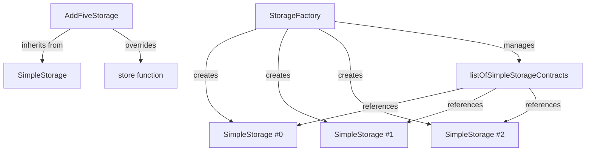

## Overview

The `StorageFactory` contract demonstrates advanced Solidity concepts including **contract composition**, the **factory pattern**, and **inheritance**. It creates and manages multiple `SimpleStorage` contract instances, allowing you to interact with each one.

**Key Features:**
- Deploy new SimpleStorage contracts programmatically
- Manage multiple contract instances in an array
- Interact with child contracts from the factory
- Demonstrates contract-to-contract interactions

## Contract Composition

### StorageFactory

The main factory contract that creates and manages SimpleStorage instances.

```solidity
// SPDX-License-Identifier: MIT
pragma solidity 0.8.30;

import {SimpleStorage} from "./SimpleStorage.sol";

contract StorageFactory {
    SimpleStorage[] public listOfSimpleStorageContracts;

    function createSimpleStorageContract() public {
        SimpleStorage newSimpleStorageContract = new SimpleStorage();
        listOfSimpleStorageContracts.push(newSimpleStorageContract);
    }

    function sfStore(uint256 _simpleStorageIndex, uint256 _newSimpleStorageNumber) public {
        listOfSimpleStorageContracts[_simpleStorageIndex].store(_newSimpleStorageNumber);
    }

    function sfGet(uint256 _simpleStorageIndex) public view returns (uint256) {
        return listOfSimpleStorageContracts[_simpleStorageIndex].retrieve();
    }
}
```

### State Variables

```solidity
SimpleStorage[] public listOfSimpleStorageContracts;
```

An array that stores addresses of all deployed SimpleStorage contracts. The `public` keyword automatically creates a getter function to access contracts by index.

## Core Functions

### createSimpleStorageContract()

```solidity
function createSimpleStorageContract() public {
    SimpleStorage newSimpleStorageContract = new SimpleStorage();
    listOfSimpleStorageContracts.push(newSimpleStorageContract);
}
```

Deploys a new SimpleStorage contract and adds it to the managed list.

**What it does:**
1. Uses the `new` keyword to deploy a fresh SimpleStorage contract
2. Stores the contract reference in the array
3. Each contract gets the next available index (0, 1, 2, ...)

<Note>
Deploying contracts costs significant gas. Each call to this function deploys a completely new contract instance on the blockchain.
</Note>

### sfStore()

```solidity
function sfStore(uint256 _simpleStorageIndex, uint256 _newSimpleStorageNumber) public {
    listOfSimpleStorageContracts[_simpleStorageIndex].store(_newSimpleStorageNumber);
}
```

Interacts with a specific SimpleStorage contract to store a value.

**Parameters:**
- `_simpleStorageIndex` - Index of the target contract in the array
- `_newSimpleStorageNumber` - Value to store in that contract

**Example:** `sfStore(0, 42)` stores 42 in the first SimpleStorage contract

### sfGet()

```solidity
function sfGet(uint256 _simpleStorageIndex) public view returns (uint256) {
    return listOfSimpleStorageContracts[_simpleStorageIndex].retrieve();
}
```

Retrieves the stored value from a specific SimpleStorage contract.

**Parameters:**
- `_simpleStorageIndex` - Index of the target contract

**Returns:** The favorite number stored in that contract

## Inheritance: AddFiveStorage

The `AddFiveStorage` contract demonstrates inheritance and function overriding.

```solidity
// SPDX-License-Identifier: MIT
pragma solidity 0.8.30;

import {SimpleStorage} from "./SimpleStorage.sol";

contract AddFiveStorage is SimpleStorage {
    function store(uint256 _favoriteNumber) public override {
        myFavoriteNumber = _favoriteNumber + 5;
    }
}
```

**Key Points:**
- Uses `is SimpleStorage` to inherit all functionality
- Overrides the `store()` function to add custom behavior
- Automatically adds 5 to any number before storing it
- Must use the `override` keyword to override parent functions

<Warning>
The parent contract's `store()` function must be marked as `virtual` for this to work. In production code, ensure parent functions are properly marked.
</Warning>

## Usage Examples

<Tabs>
  <Tab title="Deploy Contracts">
    ```solidity
    StorageFactory factory = new StorageFactory();
    
    // Create three SimpleStorage contracts
    factory.createSimpleStorageContract(); // Index 0
    factory.createSimpleStorageContract(); // Index 1
    factory.createSimpleStorageContract(); // Index 2
    ```
  </Tab>
  
  <Tab title="Store Values">
    ```solidity
    // Store different values in each contract
    factory.sfStore(0, 10);  // Store 10 in contract 0
    factory.sfStore(1, 20);  // Store 20 in contract 1
    factory.sfStore(2, 30);  // Store 30 in contract 2
    ```
  </Tab>
  
  <Tab title="Retrieve Values">
    ```solidity
    // Get stored values
    uint256 value0 = factory.sfGet(0); // Returns: 10
    uint256 value1 = factory.sfGet(1); // Returns: 20
    uint256 value2 = factory.sfGet(2); // Returns: 30
    ```
  </Tab>
  
  <Tab title="Direct Access">
    ```solidity
    // Get contract address and interact directly
    SimpleStorage contract0 = factory.listOfSimpleStorageContracts(0);
    
    // Now you can call any SimpleStorage function
    contract0.addPerson("Alice", 7);
    uint256 aliceNumber = contract0.nameToNumber("Alice");
    ```
  </Tab>
</Tabs>

## Architecture Diagram



## Concepts Demonstrated

<CardGroup cols={2}>
  <Card title="Factory Pattern" icon="industry">
    Deploy and manage multiple contract instances from a single factory contract.
  </Card>
  
  <Card title="Contract Composition" icon="puzzle-piece">
    Import and use other contracts within your contract code.
  </Card>
  
  <Card title="Inheritance" icon="sitemap">
    Extend existing contracts and override functions with custom behavior.
  </Card>
  
  <Card title="Contract Interactions" icon="handshake">
    Call functions on other deployed contracts using their addresses.
  </Card>
</CardGroup>

## Key Takeaways

<Check>
**StorageFactory teaches advanced Solidity patterns:**
- Using the `new` keyword to deploy contracts programmatically
- Storing and managing contract references in arrays
- Calling functions on external contract instances
- Inheritance with `is` keyword
- Function overriding with `override` keyword
- The factory pattern for managing multiple similar contracts
</Check>

<Note>
**Factory Pattern Use Cases:**
- Creating multiple instances of the same contract type
- Managing upgradeable contract systems
- Building decentralized exchanges with multiple token pairs
- Deploying user-specific contract instances
</Note>

## Gas Considerations

<Warning>
Deploying contracts is expensive! Each call to `createSimpleStorageContract()` deploys a full contract to the blockchain.

**Gas costs:**
- Creating a new contract: ~150,000+ gas
- Storing values: ~20,000-50,000 gas
- Reading values: Free (if called externally)
</Warning>